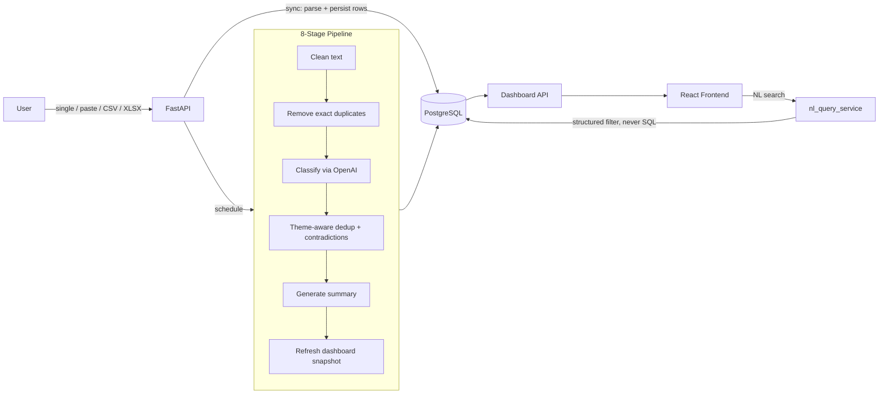

# FeedbackIQ

**AI-powered customer feedback intelligence — from raw text to a searchable, categorized analytics dashboard.**

[](backend)
[](backend)
[](frontend)
[](frontend)
[](backend)
[](backend/app/prompts)
[](LICENSE)

FeedbackIQ ingests customer feedback — a single note, a pasted batch, or a CSV/XLSX file of
thousands of rows — and runs it through an AI pipeline that classifies **category, sentiment,
emotion, theme, urgency, severity, business impact, and customer intent**. Results surface
through a SaaS-style analytics dashboard with duplicate/contradiction detection and
natural-language search.

---

## Features

- **Flexible ingestion** — single entry, pasted multi-feedback blob, or CSV/XLSX upload of
  thousands of rows, all going through the same classification pipeline.
- **Rich AI classification** — one structured call per batch tags category, sentiment,
  emotion, theme, urgency, severity, business impact, intent, a confidence score, an
  explanation, and a suggested action.
- **Live processing pipeline** — an animated 8-stage stepper (reading → cleaning → dedup →
  AI classification → theming → summary → save → dashboard-ready) so users watch large
  uploads progress in real time.
- **Duplicate & contradiction detection** — semantic, theme-aware duplicate grouping and
  same-theme/opposite-sentiment contradiction flags, without paying for embeddings.
- **Natural-language search** — ask the dashboard a plain-English question; it's translated
  into a safe, enum-constrained structured filter, never raw SQL.
- **Analytics dashboard** — KPIs, sentiment/category/emotion breakdowns, top themes, a bug
  leaderboard, feature-request ranking, and an AI-generated "Key Signals" summary.
- **Auth & roles** — cookie-based JWT auth, admin-approval gate on new signups, and a
  role-gated admin panel (usage stats, user approval, delete actions).
- **Prompt evaluation harness** — a hand-labeled gold dataset and scored before/after reports
  for every prompt revision (see [Evaluation](#evaluation) below).

---

## Tech stack

| Layer | Stack |
|---|---|
| **Frontend** | React 19, TypeScript, Vite, Tailwind CSS v4, Framer Motion, Recharts, TanStack Query, Zustand, React Router |
| **Backend** | FastAPI, SQLAlchemy 2.0, Alembic, Pydantic v2, cookie-based JWT auth |
| **Database** | PostgreSQL |
| **AI** | OpenAI structured outputs (strict JSON schemas), versioned prompt modules with few-shot examples |
| **Ingestion** | FastAPI `BackgroundTasks`, `openpyxl` (XLSX), `rapidfuzz` (fuzzy pre-filter) |

---

## Architecture



Each feedback row's AI result is stored in a **versioned** `ai_predictions` table (1:N from
`feedback`, never overwritten) — a partial unique index guarantees exactly one active
prediction per row, so re-running AI analysis keeps full history instead of clobbering it.

---

## Engineering highlights

- **One structured call, not N calls per field.** Category, sentiment, emotion, urgency,
  severity, business impact, theme, and intent are all correlated reads of the same text —
  one batched call (15 items) amortizes fixed per-call overhead instead of multiplying it.
- **Closed-set theme taxonomy** (20 canonical themes + "Other"), not free generation, so
  dashboard aggregation and NL-query filtering stay deterministic at scale.
- **Two-layer guardrails**: OpenAI `strict: true` structured-output schemas, independently
  re-validated against Pydantic models — a single point of failure can't silently corrupt data.
  One retry on malformed output, then a safe fallback (`category="Other"`,
  `needs_human_review=true`) with the raw response logged for review.
- **NL search is not RAG.** The LLM only emits a structured, enum-constrained filter object;
  `user_id` scoping is enforced unconditionally in code, so a prompt-injected query can never
  leak cross-tenant data — the code is the safety boundary, the prompt is defense-in-depth.
- **A real bug caught by testing, not just written and shipped**: the fuzzy duplicate
  pre-filter scored the project's own motivating example — *"Unable to login" / "Can't sign
  in" / "Login failed"* — too low to ever reach LLM confirmation. Fixed by sending every pair
  within a theme bucket straight to the LLM, since theme-grouping already does the real
  cost-cutting (see `duplicate_service.py`).

## Evaluation

`backend/eval/` ships a 31-item hand-labeled gold set covering typos, emoji, sarcasm,
code-switched text, rambling multi-topic feedback, and duplicate/contradiction clusters, plus
a harness (`run_eval.py`) that scores the live classifier and writes a timestamped report.

Real before/after from a prompt revision, not a hypothetical:

| Field | v1.0 | v1.1 |
|---|---|---|
| Category | 83.9% | 87.1% |
| Sentiment | 96.8% | 96.8% |
| Theme | 83.9% | 80.6% |
| Urgency | 71.0% | **80.6%** |
| Emotion | 87.1% | 90.3% |

The v1.0 baseline under-called severity on crash/data-loss reports (71% on urgency); v1.1
added an explicit urgency decision rule and a new few-shot example, fixing the gap. Reported
as-is, including the small theme regression — a 31-item set is small enough that some
movement is noise.

---

## Getting started

Full setup (database, backend, frontend, admin promotion, running the eval) is in
**[SETUP.md](SETUP.md)**. Quick version:

```bash
# Database
psql -U postgres -c "CREATE ROLE feedbackiq LOGIN PASSWORD 'feedbackiq';"
psql -U postgres -c "CREATE DATABASE feedbackiq OWNER feedbackiq;"

# Backend
cd backend && python3 -m venv .venv && source .venv/bin/activate
pip install -r requirements.txt
cp .env.example .env   # set DATABASE_URL, OPENAI_API_KEY, JWT_SECRET
alembic upgrade head
uvicorn app.main:app --reload --port 8000

# Frontend
cd frontend && npm install
cp .env.example .env   # VITE_API_BASE_URL=http://localhost:8000/api/v1
npm run dev
```

Then register at `/register`, upload `backend/eval/seed_feedback_dataset.csv` from the
**Upload** page, and watch it flow through the dashboard.

---

## Project layout

```
backend/
  app/
    prompts/          versioned prompt modules (PROMPT_VERSION, few-shots, JSON schemas)
    db/models/         SQLAlchemy models, incl. the versioned ai_predictions schema
    services/           ai_service, pipeline_service, duplicate_service,
                         contradiction_service, dashboard_service, nl_query_service
    api/v1/endpoints/    auth, uploads, feedback, dashboard, nl_query, exports, admin
  eval/
    eval_dataset.json    31-item hand-labeled gold set
    run_eval.py          evaluation harness
    reports/             timestamped before/after eval reports
    seed_feedback_dataset.csv   135-row realistic demo dataset
frontend/
  src/
    features/            dashboard, upload, feedback, admin — feature-scoped components
    pages/                route-level pages
    api/                  typed API client
```

---

## Roadmap / known limitations

- Contradiction detection is a zero-LLM heuristic (same theme + opposite sentiment); an
  LLM-confirmation layer is a planned enhancement.
- Admin user management covers approval and delete actions; role changes and deactivation
  are not yet built.
- Exports are CSV only.
- Background jobs run in-process (FastAPI `BackgroundTasks`); a distributed queue
  (Celery/Redis) is the natural upgrade for multi-instance deployment.
- Dedup/contradiction detection is scoped within a single upload batch, not cross-batch/all-time.

## License

[MIT](LICENSE)
